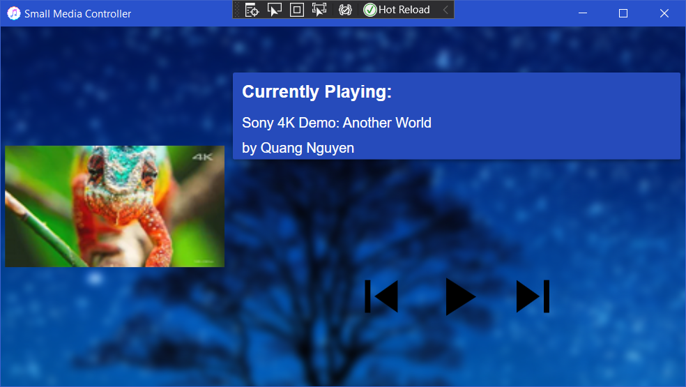
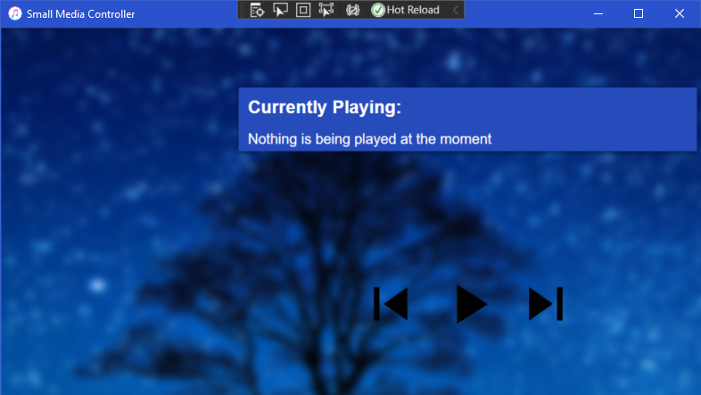

# Small Media Control
This Program lets you control anything that is currently playing.

Work in Progress. Works for Programs, which doesn't open new Sessions whenever they play a new Song like Groove-Music. Other programs like YouTube Music won't work at the moment.

## What is this program for?
I have an Asus laptop and Asus build something in their Laptops, which they call a [Screenpad](https://www.asus.com/us/site/zenbook/screenpad/). It's basically a screen in the Touchpad. I personally use it to listen to Music and I want to control other Apps which play music, but if you just need a program which shows you, what is currently played and can control it, this Program is made for you.

## How to use?
Well, i didn't compile it at the moment, so you need to check it out from GitHub, add a Reference to [WindowsMediaController](https://github.com/benehmb/WindowsMediaController) and set MediaControllerUI as default project. Then you could probably just click run.

## Which IDE to use?
I am using [Visual Studio Community](https://visualstudio.microsoft.com/), but you could also use [Rider](https://www.jetbrains.com/rider/), but I don't know how to import this Solution into Rider.

## What can I do?
In this Project, you can see a "TODO.md". If you really want to do something, just read it and try whatever you can.

## Credit and API
The API I use, which connects to the WindowsMediaConrtoller (refereed project in 'How to use') is by [DubyaDude](https://github.com/DubyaDude)
Thanks DubyaDude for publishing this!